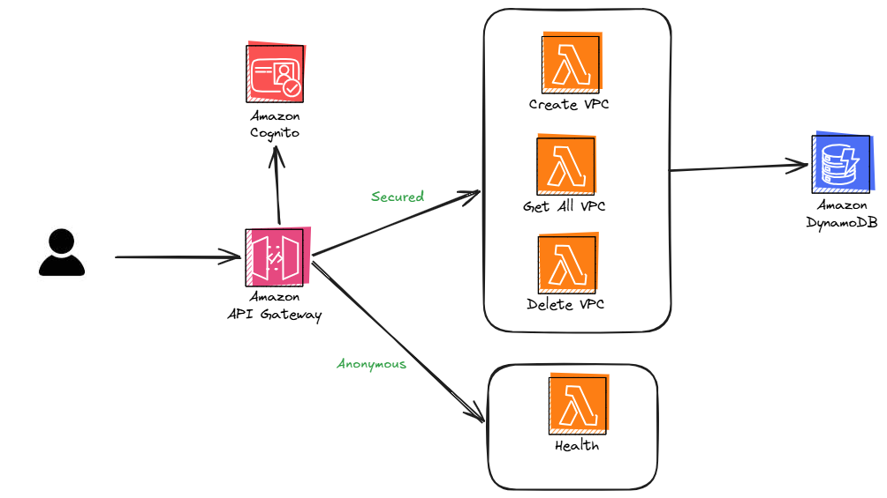
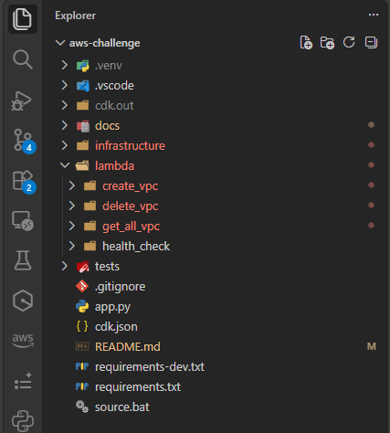
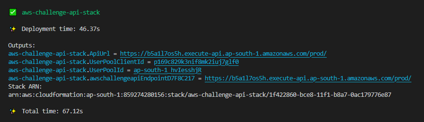

# AWS Challenge 2026

## Problem Statement
Create an API based on AWS services that can create a VPC with multiple subnets and store the results. We need to be able to retrieve the data of created resources from the API. The code should be written in Python. The API should be protected with an authentication layer. Authorization should be open to all authenticated users. 

## Architecture Diagram


## Prerequisites
1. Python 3.14 or later installed. Refer [Python](https://www.python.org/downloads/)
2. Node.js 22.x or later installed. Refer [Node.js](https://nodejs.org/en/download/)
3. Run `npm install -g aws-cdk` to install the AWS CDK CLI.
4. Setup your AWS credentials. Refer [Configure environments to use with the AWS CDK](https://docs.aws.amazon.com/cdk/v2/guide/configure-env.html)

## Directory Structure


## Build the solution (Synthesize a CDK app)
1. Clone the repository:
   ```bash
   git clone https://github.com/ankushjain358/aws-challenge.git
   cd aws-challenge
   ```
2. Create a virtual environment and activate it:
   ```bash
   python -m venv .venv
   source .venv/bin/activate  # On Windows use `.venv\Scripts\activate`
   ```
3. Install the required dependencies:
   ```bash
   pip install -r requirements.txt  
   pip install -r requirements-dev.txt  
   ```
4. Run the following command to synthesize the CloudFormation template:
   ```bash
   cdk synth
   ```
   > Note: If you encounter issue in synth, then set JSII_SILENCE_WARNING_UNTESTED_NODE_VERSION environment variable to true and try again.

## Deploy the solution
1. Make sure you are in the root directory of the project and your virtual environment is activated.
2. Bootstrap the CDK environment (if not done already):
   ```bash
   cdk bootstrap
   ```
3. Run the following command to deploy the stack:
   ```bash
   cdk deploy
   ```
4. After the deployment is complete, you will see the API URL and Cognito User Pool ID in the output.

   

## Verification Prerequisite - Generating JWT token
1. Create a test user
    ```bash
    aws cognito-idp admin-create-user --user-pool-id "<USER_POOL_ID>" --username "<EMAIL>" --user-attributes "Name=email,Value=<EMAIL>" "Name=email_verified,Value=true" --message-action SUPPRESS
    ```
   `--message-action SUPPRESS` creates the user without sending an invitation email or SMS.

2. Set a permanent password
    ```bash
    aws cognito-idp admin-set-user-password --user-pool-id "<USER_POOL_ID>" --username "<EMAIL>" --password "<PASSWORD>" --permanent
    ```
   After this command succeeds, Cognito marks the user as `CONFIRMED`, so they can sign in without a new-password challenge.

3. Generate a JWT token
    ```bash
    aws cognito-idp initiate-auth --client-id "<APP_CLIENT_ID>" --auth-flow USER_PASSWORD_AUTH --auth-parameters "USERNAME=<EMAIL>,PASSWORD=<PASSWORD>"
    ```
    The response contains the Cognito tokens:
    ```json
    {
        "AuthenticationResult": {
            "AccessToken": "...",
            "IdToken": "...",
            "RefreshToken": "...",
            "ExpiresIn": 3600
        }
    }
    ```

## Verification - Testing the API

Use an API client such as [Postman](https://www.postman.com/) or [ReqBin](https://reqbin.com/) to send requests. Set `<API_URL>` to the deployed API URL, for example `https://<api-id>.execute-api.<region>.amazonaws.com/prod`.

For each protected request, set the `Authorization` header to `Bearer <JWT_TOKEN>`, using the `IdToken` from the previous step. For the create request, set the body type to JSON (`application/json`).

### 1. Health Check

- Method: `GET`
- URL: `<API_URL>/api/health`
- Authentication: None

### 2. Create a VPC

- Method: `POST`
- URL: `<API_URL>/api/vpcs`
- Body:
   ```json
   {
      "vpc_name": "my-vpc",
      "cidr_block": "10.0.0.0/16"
   }
   ```

Save the `vpc_id` from the successful response for the delete request.

### 3. Get VPC details

- Method: `GET`
- URL: `<API_URL>/api/vpcs`

### 4. Delete a VPC

- Method: `DELETE`
- URL: `<API_URL>/api/vpcs/<vpc_id>`
- Replace `<vpc_id>` with the ID returned when you created the VPC.


## Clean up
Remove the deployed resources to avoid incurring charges:
```bash
cdk destroy aws-challenge-api-stack
```
or go to the AWS Management Console and delete the stack manually.

## References
- [Working with the AWS CDK in Python](https://docs.aws.amazon.com/cdk/v2/guide/work-with-cdk-python.html)
- [Serverless Patterns Collection](https://serverlessland.com/patterns)
- [Powertools for AWS Lambda (Python)](https://docs.aws.amazon.com/powertools/python/latest/utilities/data_classes/)

## Best practices
1. Always execute commands in a virtual environment to avoid dependency conflicts.
2. Your `requirements.txt` should list only top-level dependencies (modules that your app depends on directly) and not the dependencies of those libraries. To follow this, you can use the following steps:
    - Install packages using `pip install <package_name>`.
    - Run `pip show <package_name>` to view the package version and its dependencies.
    - Then manually add `<package_name>==2.32.5` to your `requirements.txt` file.
3. Developer experience
    - Use `pylance` to prevent type errors, and get intellisense support. Refer [preventing type errors](https://docs.aws.amazon.com/cdk/v2/guide/work-with-cdk-python.html#python-managemodules)